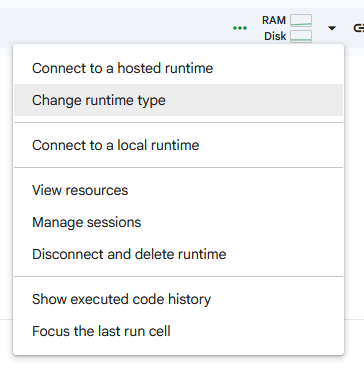
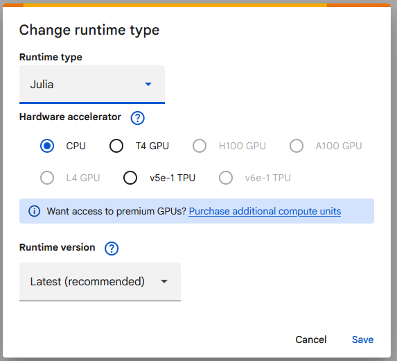

# PMD Transformer Model Tutorial

 [Make sure to change runtime to Julia](#using-google-colab-to-run-the-tutorial)

This repository serves as a comprehensive tutorial for modelling power transformers using [`PowerModelsDistribution.jl`](https://github.com/lanl-ansi/PowerModelsDistribution.jl). It is designed to help users bridge the gap between intuitive "Engineering" definitions (such as those in [OpenDSS](https://sourceforge.net/projects/electricdss/)) and the "Mathematical" decomposition used for optimization.

The tutorial covers:
- **Transformer Modelling Theory**: From basic principles to circuit equivalents.
- **OpenDSS Integration**: Parsing `.dss` transformer definitions into Engineering models.
- **Mathematical Decomposition**: Understanding how n-winding transformers are represented effectively in optimization models.
- **Vector Groups**: An interactive exploration of phase shifts, connection types (Delta/Wye), and winding permutations.

## Access the Tutorial

- 🌐 **[View HTML Version](https://mohamednumair.github.io/PMD-Transformer-Model-Tutorial/)**  
  The best way to read the tutorial comfortably in your browser.

- 📓 **[View Jupyter Notebook](PMD_Transformer_Tutorial.ipynb)**  
  Access the source notebook to run the Julia code and interact with the vector group simulations locally.

## Using google Colab to run the tutorial

You can run the tutorial directly in your browser using Google Colab. Just click the "Open in Colab" button at the top of this README. However, make sure to change the runtime type to Julia by following these steps:

from the top dropdown menu, select `Change runtime type`. Then choose `Julia` from the `Runtime type` dropdown menu and click `Save`.

## References

For transformer model implementation details refer to *S. Claeys, G. Deconinck and F. Geth, “Decomposition of n-winding transformers for unbalanced optimal power flow,” IET Generation, Transmission & Distribution, vol. 14, no. 24, pp. 5961-5969, 2020, DOI: 10.1049/iet-gtd.2020.0776.*

## Contribute and raise issues
While great care was put into validating the correctness of the tutorial content, there may still be mistakes or areas for improvement. If you find any issues or have suggestions, please feel free to raise them in the [Issues](https://github.com/MohamedNumair/PMD-Transformer-Model-Tutorial/issues).